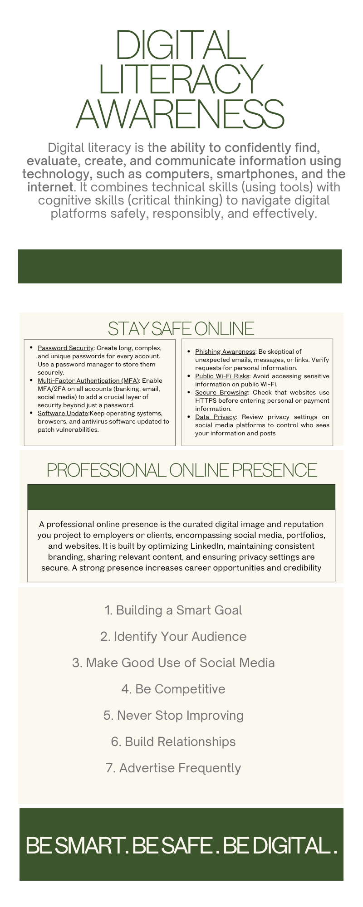

# digital-literacy-project
# Digital Literacy Project

## Task 1: Digital Literacy Awareness Infographic

This infographic explains digital literacy, safe internet practices, and professional online presence.
Digital Literacy Awareness Infographic – Task 1
Overview
This repository contains my Digital Literacy Awareness Infographic created as part of Module 1. The infographic aims to help students understand what digital literacy is and why it matters.
Tool Used
I used Canva to design the infographic because it offers ready-made templates, icons, and customization options, making it easy to create visually appealing content.
Content of the Infographic
The infographic covers three key areas:
What Digital Literacy Is – a brief definition of digital literacy.
Safe Internet Practices – tips on online safety, strong passwords, avoiding phishing, and protecting privacy.
Useful Digital Tools for Students – examples like Google Drive, Canva, Notion, and Grammarly.
Reflection
Creating the infographic was interesting because I had to balance text and visuals to make it clear and attractive. Choosing icons and arranging the layout without cluttering the page was the most challenging part, but it helped me understand the importance of visual communication in digital literacy.
File Location
The final infographic is available here:
task-1-presentation/infographic.png

